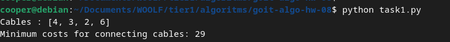

### Завдання 1 ([task1.py](task1.py))

Уявіть, що вам на технічному інтерв'ю дають наступну задачу, яку треба розв'язати за допомогою купи.

Є декілька мережевих кабелів різної довжини, їх потрібно об'єднати по два за раз в один кабель, використовуючи з'єднувачі, у порядку, який призведе до найменших витрат. Витрати на з'єднання двох кабелів дорівнюють їхній сумі довжин, а загальні витрати дорівнюють сумі з'єднання всіх кабелів.

Завдання полягає в тому, щоб знайти порядок об'єднання, який мінімізує загальні витрати.

### Розвязок

Ця задача є класичним прикладом мінімізації вартості за допомогою мінімальної купи (min-heap). Ідея полягає в тому, щоб на кожному кроці об'єднувати два кабелі з найменшою довжиною, що дозволяє звести до мінімуму загальні витрати.

 - Ми використовуємо модуль heapq, який реалізує мінімальну купу.
 - Кожен раз витягуємо два найменші кабелі з купи, додаємо їхню суму назад до купи та підраховуємо загальні витрати.

